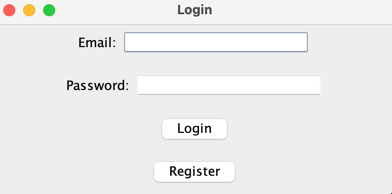
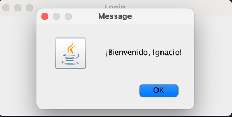
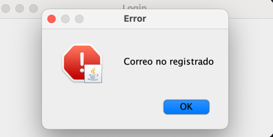
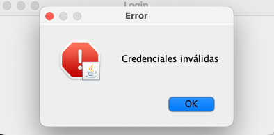
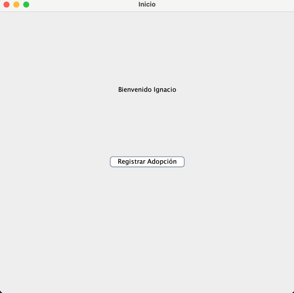
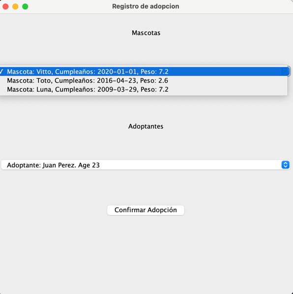
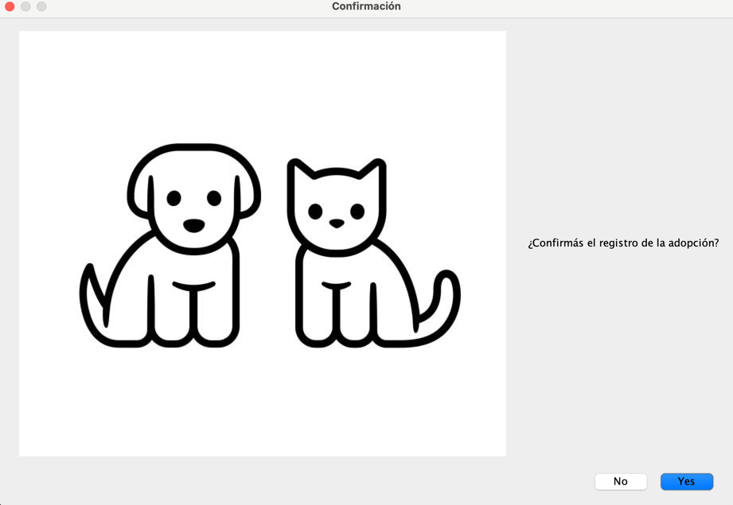
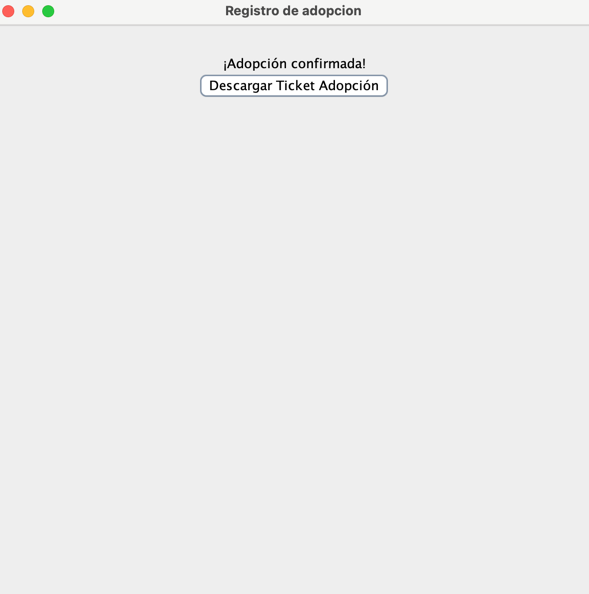
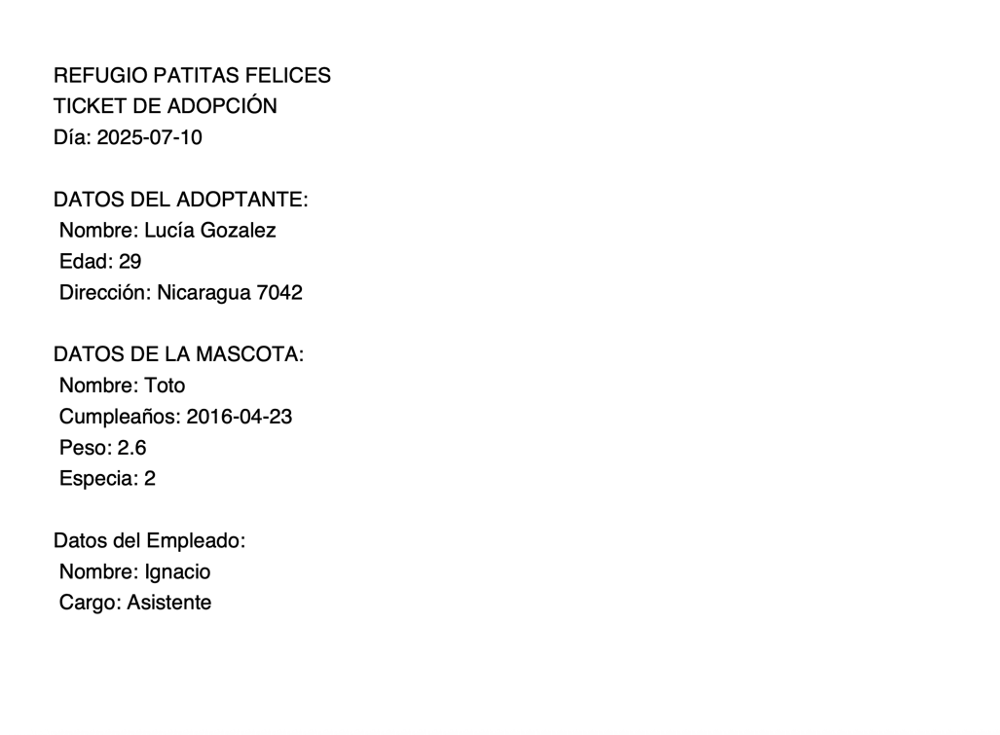

# Segundo Parcial Programación Avanzada

## Profesor: Horacio Valenzuela
## Alumno: Ignacio Heim

### Funcionalidades
La funcionalidad de la aplicación consiste en un sistema de registro de adopciones de mascotas.

El usuario deberá loguearse al sistema con su correo y contraseña. En caso de error, no podrá acceder al sistema.
Si se podrá crear un nuevo usuario.

La ***funcionalidad principal*** es elegir de una lista ya prestablecida, un animal y adoptante. Luego habrá una opción de confirmar la adopción.

Finalmente, el usuario tiene la posibilida de descargar el ticket de la adopción en formato PDF.

### Estrucutra del proyecto
    /src
        /app            -> Acceso controller
        /controller     -> Manejo de eventos / lógica de la vista
        /dao            -> Acceso a datos
        /infrastructure -> Clases accesorias
        /model          -> Entidades
        /resources      -> Imágenes
        /service        -> Lógica de negocio
        /view           -> Interfaz de usuario (Swing)

### Capturas de pantalla de la adopción

1. Login

2. Ingreso correto

3. Ingreso denegado

4. Registrar adopcion

5. Elegir mascota y adoptante

6. Confirmar adopcion

7. Descargar ticket adopción

8. PDF descargado

